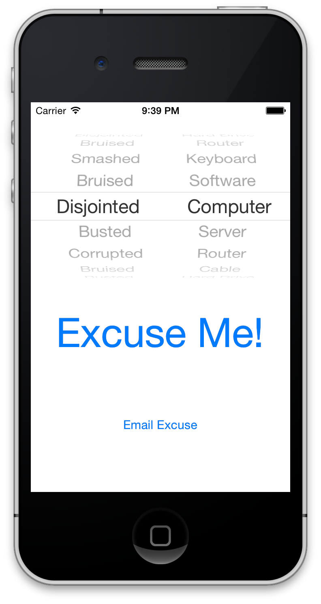
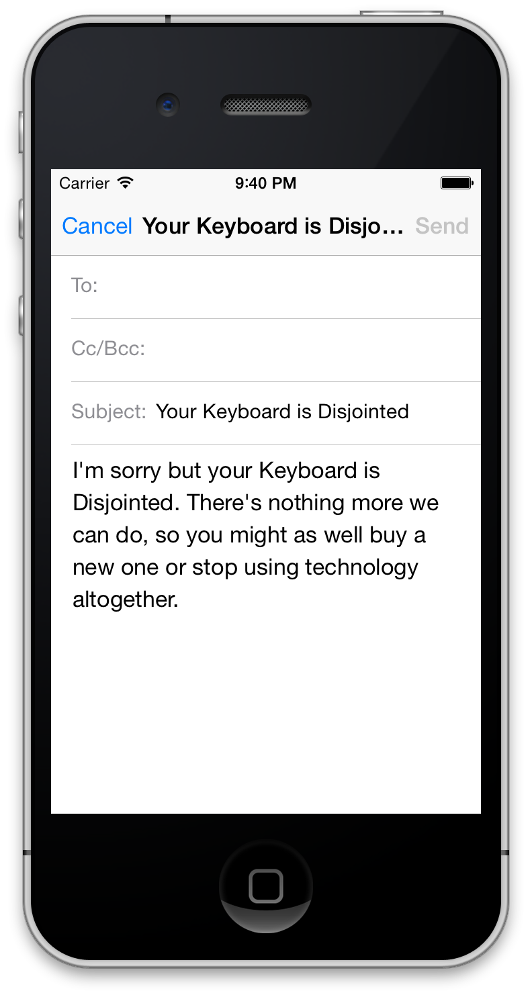

# BlackWatch

BlackWatch is a thing that does stuff.

## Features

BlackWatch allows you to press a button to come up with a random excuse for an IT problem, then email that excuse to your end users. You should probably never do this.

## Installation

1. Figure out how the hell you're going to get this application installed on your iOS device. Here are your options:
    1. Pay Apple $300 every year for the iOS Developer Enterprise Program. Then deal with creating, updating, and deploying Provisioning Profiles and certificates for the app, (but you'll have the added benefit of being able to deploy the app to your entire IT organization).
    2. Pay Apple $100 every year for the iOS Developer Program. Then turn your $700 iPhone into a "Development" phone and run it only on that device.
    3. Jailbreak your iPhone. Then do whatever you want because you're awesome.
    4. Pay Apple $100 every year for the iOS Developer Program. Then submit this app to the App Store as your own. I won't be upset about it, I promise.
    5. Pay Apple $0 every year and run the app in the iOS simulator on your Mac, (or Hackintosh if you rock). You won't be able to email anyone, but at least it will help you come up with ideas.
2. There is no step 2.
